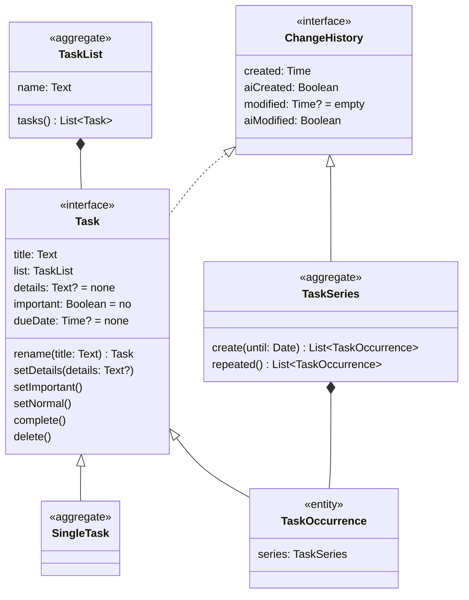

# Package fi.apinkivi.life.context.task

# Task Management Bounded Context

I define how I want to manage my tasks.

## Task requirements

1. I prefer devices for management in the following order:
   1. Watch (currently Google Pixel Watch 2 Wifi)
   2. Phone (currently Google Pixel 7a)
   3. Tablet (currently Lenovo Yoga 460 in tablet mode)
   4. Computer
2. I want to chat and message with an AI to manage my tasks, so Gemini must:
   1. know the big picture of my tasks.
   2. be able to add and edit them at my command.
   3. be able to help organize them.
   4. be able to create task occurrences for recurring tasks and "remove" past uncompleted ones to avoid distraction.
   5. know my completed tasks to estimate my completion time.
3. Personal and business-related tasks are integrated as well as possible with Google products (Tasks, Calendar, and Keep) so I can use their user interfaces.
4. Work tasks are integrated as well as possible with Microsoft enterprise products (Outlook To Do, Outlook Calendar) so I can use their user interfaces.
5. I want to collect statistics on my tasks to draw graphs and track my performance.
6. Tasks must be backed up daily.
7. Backups are stored in Google Drive as follows:
   - Daily backups for a week.
   - Monday backups for a month.
   - No backups for the first day of the month for now.

## Task Domain Model

The task domain includes individual and recurring tasks.

### Task List

In To Do, a single default list named `General` is used.

| Property | _Tasks_ | Notes      |
| -------- | ------- | ---------- |
| `name`   | _Name_  | Identifier |

### Task

| Property    | _Tasks_      | _To Do_      | Notes                                                                                                                            |
| ----------- | ------------ | ------------ | -------------------------------------------------------------------------------------------------------------------------------- |
| `created`   |              |              | Identifier. If a task with the same identifier already exists upon creation, milliseconds are added until a unique one is found. |
| `title`     | _Title_      |
| `important` | ⭐ _starred_ | _Importance_ |
| `dueDate`   | _Due date_   | _Due date_   | _Tasks_ and _To Do_ store the date.                                                                                              |

